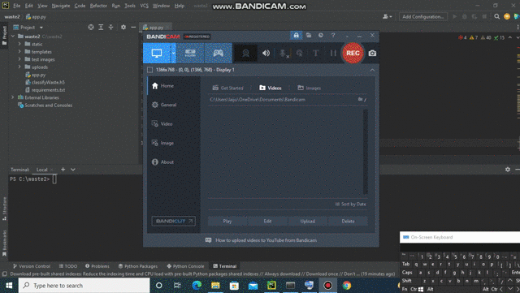

# Waste-Materials-Classification-Web-App


This repository consists of files required for end to end implementation and deployment of Waste-Materials-Classification-Web-Application using Transfer Learning.

## Table of Contents
  * [About the App](#about-the-app)
  * [Technologies Used](#technologies-used)
  * [Bug / Feature Request](#bug---feature-request)


## About the App

A glimpse of the web app:



The Waste-Materials-Classification is a flask web application developed with VGG16 which classify "batteries", "clothes", "e-waste", "glass", "light blubs", "metal", "organic", "paper", "plastic".

To install the required packages and libraries, run this command in the project directory after [cloning](https://github.com/laijupjoy/Waste-Materials-Classification-Web-App.git) the repository::
```bash
pip install -r requirements.txt
```
To run the web app in local environment, use the command
```bash
python app.py
```

## Technologies Used

   VGG16

   Flask

## Bug / Feature Request

If you find a bug (the website couldn't handle the query and / or gave undesired results), kindly open an [issue](https://github.com/laijupjoy/Waste-Materials-Classification-Web-App/issues) here by including your search query and the expected result